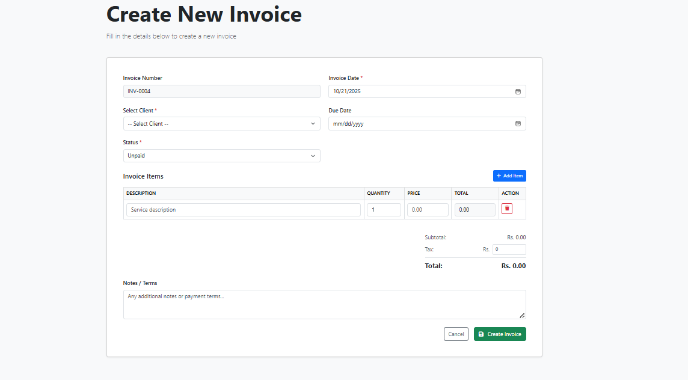
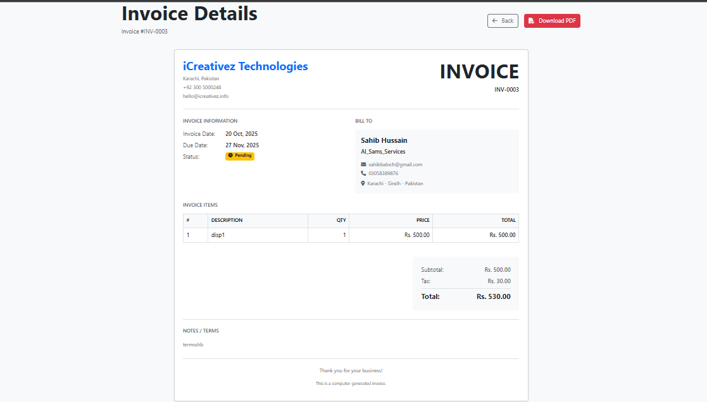
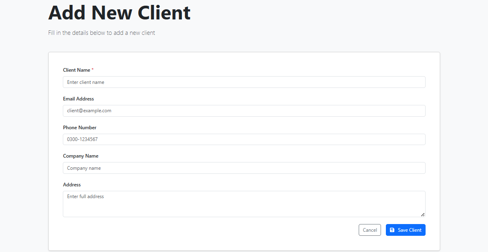
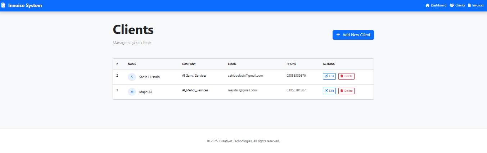
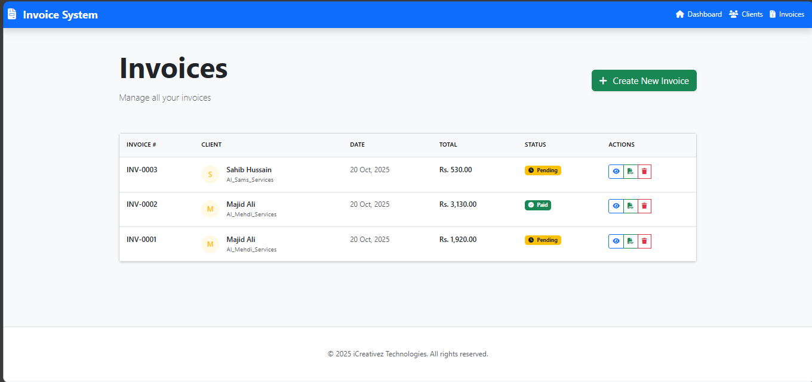

# 🧾 Laravel Invoice & Billing System

A professional, clean, and responsive Invoice & Billing management system built with Laravel 11.


## 📸 Screenshots

### Dashboard


### Invoice Creation


### Invoice Client


### Create Client


### Client List


### PDF Output


## ✨ Features

- 👥 **Client Management** - Add, edit, and manage client profiles
- 🧾 **Invoice Creation** - Create professional invoices with multiple line items
- 💰 **Auto Calculations** - Automatic subtotal, tax, and total calculations
- 📄 **PDF Generation** - Download print-ready invoice PDFs
- 📊 **Dashboard** - View total clients, invoices, and revenue at a glance
- 📱 **Fully Responsive** - Works perfectly on mobile, tablet, and desktop
- 🎨 **Modern UI** - Clean design with Bootstrap CSS
- ✅ **Status Tracking** - Mark invoices as Paid/Unpaid/Pending

## 🛠️ Tech Stack

- **Backend:** Laravel 12
- **Frontend:** Blade Templates + Bootstrap
- **Database:** MySQL
- **PDF Generation:** DomPDF
- **Icons:** Font Awesome

## 📋 Requirements

- PHP >= 8.2
- Composer
- MySQL
- Node.js & NPM (optional, for asset compilation)

## 🚀 Installation

1. **Clone the repository**
```bash
git clone https://github.com/majid-ali-dev/laravel-invoice-billing-system.git
cd laravel-invoice-system
```

2. **Install dependencies**
```bash
composer install
```

3. **Copy environment file**
```bash
cp .env.example .env
```

4. **Generate application key**
```bash
php artisan key:generate
```

5. **Configure database**
Open `.env` file and update:
```env
DB_CONNECTION=mysql
DB_HOST=127.0.0.1
DB_PORT=3306
DB_DATABASE=invoice_system
DB_USERNAME=root
DB_PASSWORD=
```

6. **Run migrations**
```bash
php artisan migrate
```

7. **Start development server**
```bash
php artisan serve
```

8. **Visit the application**
```
http://localhost:8000
```

## 📖 Usage Guide

### Creating a Client
1. Navigate to **Clients** from the top menu
2. Click **Add New Client**
3. Fill in client details (name, email, phone, company, address)
4. Click **Save Client**

### Creating an Invoice
1. Navigate to **Invoices** from the top menu
2. Click **Create New Invoice**
3. Select a client from dropdown
4. Add invoice items (description, quantity, price)
5. Add tax if applicable
6. Add notes/terms (optional)
7. Click **Create Invoice**

### Downloading PDF
1. Go to **Invoices** list
2. Click the PDF icon next to any invoice
3. PDF will be downloaded automatically

## 📁 Project Structure
```
laravel-invoice-system/
├── app/
│   ├── Http/Controllers/
│   │   ├── ClientController.php
│   │   └── InvoiceController.php
│   └── Models/
│       ├── Client.php
│       ├── Invoice.php
│       └── InvoiceItem.php
├── database/
│   └── migrations/
│       ├── create_clients_table.php
│       ├── create_invoices_table.php
│       └── create_invoice_items_table.php
├── resources/
│   └── views/
│       ├── layouts/
│       │   └── app.blade.php
│       ├── clients/
│       │   ├── index.blade.php
│       │   ├── create.blade.php
│       │   └── edit.blade.php
│       ├── invoices/
│       │   ├── index.blade.php
│       │   ├── create.blade.php
│       │   ├── show.blade.php
│       │   └── pdf.blade.php
│       └── dashboard.blade.php
└── routes/
    └── web.php
```

## 🎯 Key Highlights

- ✅ **Clean Code:** Well-organized, commented, and easy to understand
- ✅ **MVC Architecture:** Proper separation of concerns
- ✅ **Responsive Design:** Mobile-first approach
- ✅ **Professional UI:** Modern and user-friendly interface
- ✅ **Scalable:** Easy to extend with new features
- ✅ **Production Ready:** Follows Laravel best practices

## 📊 Database Schema

### Clients Table
- id, name, email, phone, company, address, timestamps

### Invoices Table
- id, invoice_number, client_id, invoice_date, due_date, status, subtotal, tax, total, notes, timestamps

### Invoice Items Table
- id, invoice_id, description, quantity, price, total, timestamps

## 🤝 Contributing

Contributions are welcome! Please feel free to submit a Pull Request.

## 📝 License

This project is open-sourced under the MIT License.

## 👨‍💻 Developer

**Majid Ali**  
Laravel Developer at iCreativez Technologies  
📧 Email: majidalishar2@gmail.com  
🔗 GitHub: [@https://github.com/majid-ali-dev](https://github.com/majid-ali-dev/laravel-invoice-billing-system)

## 🙏 Acknowledgments

- Built as part of iCreativez Technologies training program
- Special thanks to the Laravel community
- UI inspiration from modern billing systems

---

⭐ If you find this project helpful, please consider giving it a star!
